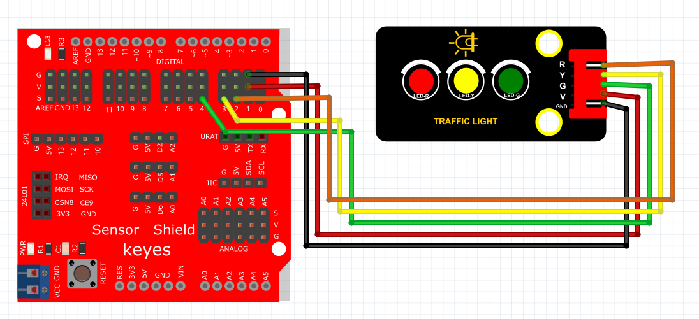

# Arduino

### 1. Arduino编程软件介绍

**Arduino**是一款广泛使用的开源电子原型平台，结合了可编程的微控制器和方便易用的硬件与软件。这一平台能够让使用者轻松创建各种电子项目，特别适合初学者和教育用途。Arduino IDE提供了一个简单直观的环境，用户可以在其中编写代码并将其上传到Arduino电路板，实现对各种传感器和LED的控制。

Arduino的开发环境支持C/C++语言，开发者可以利用丰富的库和示例，加快项目开发的进程。同时，Arduino社区非常活跃，提供了大量的资源和支持，使学习和应用变得更加容易。

---

### 2. 接线图

**接线图：**



### 3. 测试代码

```cpp
int greenled = 4;   // 定义绿灯接口
int yellowled = 3;  // 定义黄灯接口
int redled = 2;     // 定义红灯接口

void setup() {
    pinMode(redled, OUTPUT);   // 设置为输出
    pinMode(yellowled, OUTPUT); // 设置为输出
    pinMode(greenled, OUTPUT);  // 设置为输出
}

void loop() {
    digitalWrite(greenled, HIGH); // 绿灯亮起
    delay(5000); // 延迟5秒
    digitalWrite(greenled, LOW);  // 关闭绿灯

    for(int i = 0; i < 3; i++) {  // 黄灯闪烁3次
        delay(500); // 延迟0.5秒
        digitalWrite(yellowled, HIGH); // 打开黄灯
        delay(500); // 延迟0.5秒
        digitalWrite(yellowled, LOW); // 关闭黄灯
        delay(500); // 延迟0.5秒
    }

    digitalWrite(redled, HIGH); // 打开红灯
    delay(5000); // 延迟5秒
    digitalWrite(redled, LOW);  // 关闭红灯
}
```

### 4. 代码介绍

- **int greenled = 4;**  
  定义与绿色LED相连的引脚，作为信号输出。

- **int yellowled = 3;**  
  定义与黄色LED相连的引脚。

- **int redled = 2;**  
  定义与红色LED相连的引脚。

- **void setup()**  
  在这里进行一次性设置，将LED引脚配置为输出模式，通过`pinMode()`函数实现。

- **void loop()**  
  该循环将被反复执行，首先点亮绿灯并延迟5秒，然后关闭绿灯。接着，循环三次开启黄灯，每次持续0.5秒。最后点亮红灯并持续5秒。

### 5. 实验结果

上传代码成功后，上电运行模块，三个LED将自动模拟交通灯的运行方式：

1. **绿灯**持续亮起5秒，提醒车辆可以通行。
2. **黄灯**闪烁3次，每次0.5秒，表示即将要停止通行。
3. **红灯**亮起5秒，提醒车辆停止通行。

这种简单的交通灯控制程序展示了Arduino在控制多个输出信号时的能力，非常适合初学者进行学习和实验。

