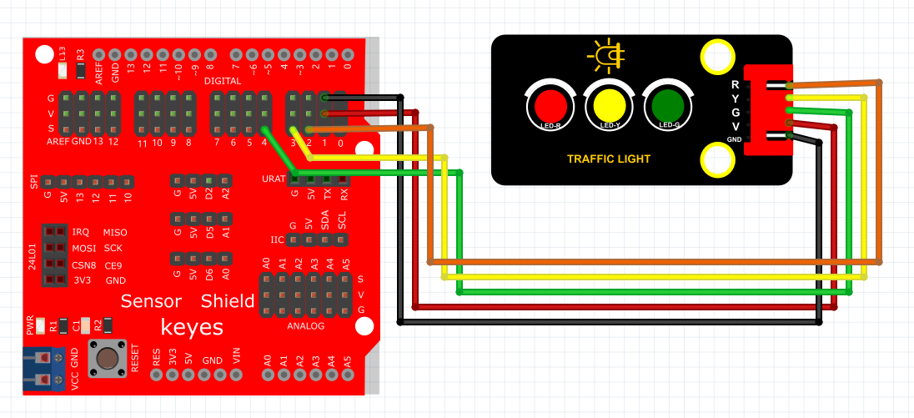

# Kidsblock

### 1. Kidsblock图形化编程软件介绍

**Kidsblock**是一种友好的图形化编程环境，设计用于帮助初学者和年轻学习者通过简单易懂的方式学习编程。这款软件允许用户以可视化的方式构建代码，使用拖拽模块来控制电子设备和传感器。通过Kidsblock，学生能够快速掌握编程概念，创造有趣的项目，如灯光控制、机器人和游戏等。

Kidsblock的图形化编程方式消除了传统编程中的复杂性，使所有年龄段的学习者都能轻松上手并应用编程知识。无论是在课堂上还是自学，它都是一种启发性极强的教学工具。

---

### 2. 接线图

**接线图：**

### 3. 测试代码

**在事件栏拖出Arduino启动模块**

**在引脚栏拖出3个设置引脚模式模块，分别设置引脚2、3、4为输出脚。**

**在控制栏拖出重复执行模块**

**在控制栏拖出数字输出模块，设置引脚为4，电平为高电平（绿灯亮）**

**在控制栏里拖出延时模块，设置延时5秒**

**在控制栏拖出数字输出模块，设置引脚为4，电平为低电平（绿灯灭）**

**在控制栏拖出可设置的重复执行模块，然后设置为3次**

**在引脚栏拖出数字输出模块，设置引脚为3，电平为高电平（黄灯亮）；在控制栏里拖出延时模块，设置延时0.5秒；将其放在重复执行模块里**

**在引脚栏拖出数字输出模块，设置引脚为3，电平为低电平（黄灯灭）；在控制栏里拖出延时模块，设置延时0.5秒；将其放在重复执行模块里**

**在引脚栏拖出数字输出模块，设置引脚为2，电平为高电平（红灯亮）**

**在控制栏里拖出延时模块，设置延时5秒**

**在引脚栏拖出数字输出模块，设置引脚为2，电平为低电平（红灯灭）**

### 4. 生成代码

通过上述图形化模块，最终生成的Arduino代码为：

### 5. 实验结果

上传代码成功后，上电运行模块，三个LED将自动模拟交通灯的运行方式：

1. **绿灯**亮起5秒，代表通行。
2. **黄灯**闪烁3次，每次持续0.5秒，警示即将变红。
3. **红灯**亮起5秒，代表停止通行。

这种简单的交通灯控制示例不仅说明了Kidsblock的强大和易用性，还激发了学习者的创造力和实践能力，非常适合教学和课外活动。

