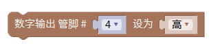
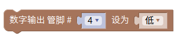
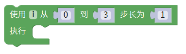
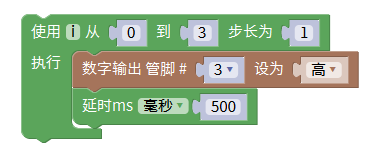
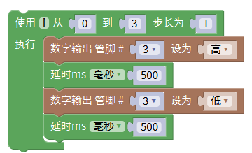
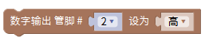
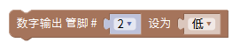
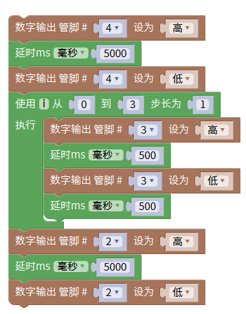

# Mixly

### 1. Mixly图形化编程软件介绍

**Mixly**是一款适合初学者和学生的开源图形化编程软件，旨在通过可视化编程环境简化硬件控制。用户可以通过拖曳模块，轻松创建Arduino项目，从而控制LED灯、传感器和其他电子元件。Mixly不仅能帮助学习编程的基本概念，还能够激发创意思维，并提供了一种乐趣横生的学习方式，适合课堂教学和个人项目。

Mixly支持多种Arduino型号，并为用户提供许多现成的示例和教程，帮助快速上手。

---

### 2. 接线图

**接线图：**

### 3. 测试代码

#### 实现步骤

1. **在输入/输出栏拖出数字输出模块，设置引脚为4，电平为高电平（绿灯亮）**  
   

2. **在控制栏里拖出延时模块，设置延时5秒**  
   

3. **在输入/输出栏拖出数字输出模块，设置引脚为4，电平为低电平（绿灯灭）**  
   

4. **在控制栏拖出for循环模块，设置从0到3步长为1**  
   

5. **在输入/输出栏拖出数字输出模块，设置引脚为3，电平为高电平（黄灯亮）；在控制栏里拖出延时模块，设置延时0.5秒，并放在for循环模块的执行里**  
   

6. **在输入/输出栏拖出数字输出模块，设置引脚为3，电平为低电平（黄灯灭）；在控制栏里拖出延时模块，设置延时0.5秒，并放在for循环模块的执行里**  
   

7. **在输入/输出栏拖出数字输出模块，设置引脚为2，电平为高电平（红灯亮）**  
   

8. **在控制栏里拖出延时模块，设置延时5秒**  
   

9. **在输入/输出栏拖出数字输出模块，设置引脚为2，电平为低电平（红灯灭）**  
   

### 4. 生成代码

通过上述图形化模块可以生成以下Arduino代码：

### 5. 实验结果

上传代码成功后，上电运行模块，三个LED将自动模拟交通灯的运行方式：

1. **绿灯**亮起5秒，代表通行。
2. **黄灯**闪烁三次，每次持续0.5秒，警示即将变红。
3. **红灯**亮起5秒，代表停止通行。

这个项目有效展示了Mixly软件的直观性和便利性，同时也让学习者通过实际操作理解了编程和电子控制的基本原理。

