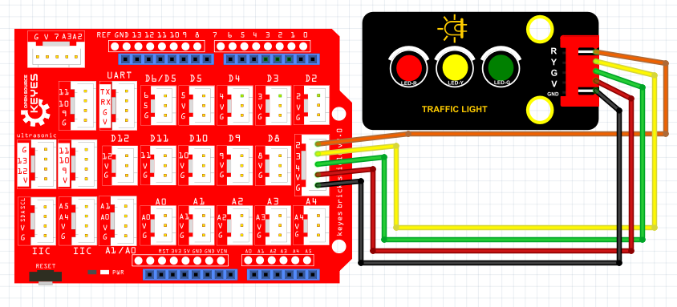

# Python

### 1. MicroPython编程软件介绍

**MicroPython**是一种轻量级的Python编程实现，专为微控制器和嵌入式系统设计。它能够将Python的强大功能应用于微控制器，使开发人员能够以简单和直观的方式控制硬件。MicroPython具有丰富的库支持，能够帮助用户快速实现各种功能，如GPIO控制、PWM输出和与各种传感器的交互。

MicroPython特别适用于教育和项目开发，能够让用户快速上手编程并进行实验。它支持多种硬件平台，包括树莓派Pico、ESP8266和ESP32等，是学习嵌入式编程的理想选择。

---

### 2. 接线图

**接线图：**



### 3. 测试代码

以下是用于控制交通灯的MicroPython代码示例：

```python
import machine
import utime

led_green = machine.Pin(27, machine.Pin.OUT)    # 设置27脚为绿灯
led_red = machine.Pin(26, machine.Pin.OUT)       # 设置26脚为红灯
led_yellow = machine.Pin(28, machine.Pin.OUT)    # 设置28脚为黄灯

val = 0  # 设置一个变量

while True:  # 循环语句
    val = 1
    led_green.value(1)  # 设置绿灯亮
    utime.sleep(5)  # 设置延时为5秒
    led_green.value(0)  # 设置绿灯灭

    while val < 4:  # 设置条件循环体，循环3次
        val += 1
        led_yellow.value(1)  # 设置黄灯亮
        utime.sleep_ms(500)  # 设置延时500ms
        led_yellow.value(0)  # 设置黄灯灭
        utime.sleep_ms(500)  # 设置延时500ms

    led_red.value(1)  # 设置红灯亮
    utime.sleep(5)  # 设置延时5秒
    led_red.value(0)  # 设置红灯灭
```

### 4. 实验结果

上传代码成功后，上电运行模块，三个LED将自动模拟交通灯的运行方式：

1. **绿灯**亮起5秒，代表通行。
2. **黄灯**亮起并闪烁3次，每次持续0.5秒，警示即将变红。
3. **红灯**亮起5秒，代表停止通行。

这个实验利用MicroPython简洁的语法和强大的功能，让学习者能够轻松实现对LED的控制，同时了解交通信号的基本逻辑。这不仅锻炼了编程能力，还加深了对实际应用的理解。

